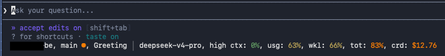

# cmd-statusline

A Command Code mod that renders a persistent status bar under the input panel:



- `<project>` — current working directory basename
- `<branch>` — git branch (green dot = clean, orange dot = uncommitted changes)
- `<session-name>` — chat session title (survives `/reload`)
- `<model>` / `<effort>` — current model and reasoning effort
- `cntx` — context-fill estimate
- `usge` / `wkly` — 5-hour and weekly usage limits
- `totl` — billing-cycle usage
- `crdt` — remaining credits, color-coded by plan (green ≥50%, yellow 25–49%, orange 10–24%, red <10%)

Percentages are color-coded by severity. Usage data comes from the Command Code API using the same auth the CLI uses (`~/.commandcode/auth.json`).

## Narrow terminals

When the line is too wide it does not end in an ellipsis. Fields are dropped from lowest priority (credits, then cycle/weekly/5-hour usage, then context/effort/model, then session/branch) down to just the project name. The bar also re-renders immediately when the terminal or pane is resized.

## Install

```bash
cmd mods add vikas-gits-good/cmd-statusline -g
```

## Configuration

The status line layout is a template, customizable via the `statusline_format` mod flag. Available tokens include `{cwd}`, `{branchPrefix}`, `{sessionPrefix}`, `{separator}`, `{modelPrefix}`, `{effortPrefix}`, `{cntx}`, `{usgePrefix}`, `{wklyPrefix}`, `{totlPrefix}`, and `{crdtPrefix}`.

## Development

Prerequisites: Node.js 22+, `cmd` on PATH (the sync scripts read model/plan data from the installed CLI).

```bash
npm ci                # NODE_ENV=development required (npm omits dev deps otherwise)
npm run typecheck     # tsc --noEmit
npm run lint          # eslint
npm run format:check  # prettier --check
npm run test:unit     # vitest with coverage (95% thresholds)
npm run test:e2e      # sync model/plan lists, build harness, run Playwright
```

The E2E suite auto-syncs the live model list and plan credits from `cmd` before running, so new models/plans are covered automatically. Five models are intentionally skipped because the Command Code CLI's own context-window map lacks them; the mod renders their `cntx` as `--`.

## Security

This mod never executes arbitrary shell. It only:

- runs `git rev-parse --abbrev-ref HEAD` and `git status --porcelain` with static, hardcoded arguments (no user input is interpolated into git commands),
- reads the Command Code API key from `COMMAND_CODE_API_KEY` (env-first) or `~/.commandcode/auth.json`, and never logs the key,
- makes HTTPS-only API calls to `api.commandcode.ai`.

Project-scoped mods are trust-gated by the Command Code host: they load only after the workspace trust prompt is accepted. User-scope and `--mod` installs load unconditionally, so install packages you trust.

## License

MIT

---

Built with [Command Code](https://commandcode.ai).
